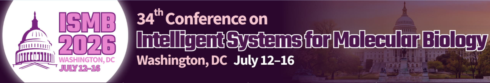

# Scalable metagenomic sequence analysis using *k*-mer-based methods
[**July 12, 2026**](https://www.iscb.org/ismb2026/whats-happening/tutorials#ip8)

- **Room: Lincoln East**
- Date: July 12, 2026
- Start Time: 09:00
- End Time: 18:00

This tutorial offers a practical introduction to *k*-mer-based approaches for large-scale metagenomic analysis, featuring some of the most widely used and prominent tools in the field. Hands-on exercises will help participants become familiar with these methods.

The tools that will be covered include:

* [Kraken2](#kraken2), [Sourmash](#sourmash-and-yacht), and [sylph](#sylph-and-skani) for taxonomic classification and profiling,
* [krepp](#krepp), [DecoDiPhy](#decodiphy), and [kf2vec](#kf2vec) for phylogenetic placement and distance estimation,
* [VirFinder and *d2*](#virfinder-and-d2) family of tools for phage identification and phage–host interaction prediction.

All sessions will consist of a short presentation to provide background and a high-level understanding of the method, followed by a hands-on interactive session.
Each tool requires a different setup and provides a different set of installation instructions. Please follow the instructions given in the **pre-tutorial setup** and have the required setup ready before the tutorial to ensure a smooth experience during the hands-on exercises.

The instructors will make their slides available either on this page or through other platforms closer to the tutorial date.

For questions, you can email me (Ali Şapcı) at asapci(at)ucsd(dot)edu or create an issue in this repository.

## Schedule and links

### 9:00 am - 9:15 am (15 mins): Siavash Mirarab

**Introduction, schedule, and logistics**

### 9:15 am - 9:45 am (30 mins): Siavash Mirarab

**Background, overview of different problems, and *k*-mer-based approaches**

### 9:45 am - 10:45 am (1 hour): Kraken2 - Ben Langmead

**Taxonomic classification using Kraken2**

* The tutorial page can be found [here](https://benlangmead.github.io/k-explore/tutorial.html)!
* For further (optional) reading and exercises, refer to [this protocol paper](https://www.nature.com/articles/s41596-022-00738-y).

### 10:45 am - 11:00 am (15 mins): Coffee Break

### 11:00 am - 12:00 pm (1 hour): VirFinder and *d2* - Fengzhu Sun

**Phage identification and phage–host interaction using VirFinder and the *d2* family of methods**

* The hands-on tutorial will be conducted through [this Colab notebook](https://colab.research.google.com/drive/12RK4Dhqrr5M_HouFl6hbbzFdv2KEihDQ).
* Participants are encouraged, but not required, to review [this protocol paper](https://doi.org/10.1002/cpz1.70310).

### 12:00 pm - 1:00 pm (1 hour): sourmash and YACHT - David Koslicki

***k*-mer sketching for fast metagenomic analysis using Sourmash and YACHT for hypothesis-testing-based taxonomic profiling**

* **Pre-tutorial setup:** Please follow the steps [here](https://github.com/KoslickiLab/ISMB-2026-workshop) to install the software and download the dataset for the exercises.
* You can find the tutorial materials and exercises [here (Sourmash)](https://github.com/KoslickiLab/ISMB-2026-workshop/blob/main/Sourmash.md) and [here (YACHT)](https://github.com/KoslickiLab/ISMB-2026-workshop/blob/main/YACHT.md).

### 1:00 pm - 2:00 pm (1 hour): Lunch Break

### 2:00 pm - 3:00 pm (1 hour): sylph and skani - Yun William Yu

**Abundance profiling using sylph and ANI calculation using skani**

* The tutorial meaterials are available at the following links for [skani](https://github.com/bluenote-1577/skani/wiki/skani-basic-usage-guide) and [sylph](https://sylph-docs.github.io/5%E2%80%90minute-sylph-tutorial/).

### 3:00 pm - 4:00 pm (1 hour): krepp - Ali Osman Berk Şapcı

**Estimating distances from reads to genomes and phylogenetic placement using krepp**

* **Pre-tutorial setup:** Please follow the steps on [this page](https://bo1929.github.io/documents/krepp-tutorial-ismb2026/02-setup.html) to install the software and download the dataset for the exercises.
* Participants will be following [this page](https://bo1929.github.io/documents/krepp-tutorial-ismb2026/) for the hands-on exercises during the tutorial.
* [**Slides**](6-krepp-AliOsmanBerkSapci.pdf).

### 4:00 pm - 4:15 pm (15 mins): Coffee Break

### 4:15 pm - 4:45 pm (30 mins): kf2vec - Eleonora Rachtman

**Converting sequences into *k*-mer feature representations for phylogenetic placement, classification, and distance estimation**

* **Pre-tutorial setup:** Follow the steps [here](kf2vec-instructions.md).
* See [this page](https://github.com/noraracht/kf2vec/blob/main/Tutorial_ISMB2026/tutorial_README.md) for the hands-on exercises.

### 4:45 pm - 5:15 pm (30 mins): DecoDiPhy - Shayesteh Arasti

**Consolidating read placements into a small number of phylogenetic placements using DecoDiPhy**

* The DecoDiPhy tutorial will follow this [Colab notebook](https://github.com/shayesteh99/DecoDiPhy/blob/main/DecoDiPhy_tutorial.ipynb).

### 5:15 pm - 5:30 pm (15 mins): Siavash Mirarab

**Discussion of applications and closing remarks**

### 5:30 pm - 5:45 pm (15 mins)

**Audience survey on the effectiveness of the course**

